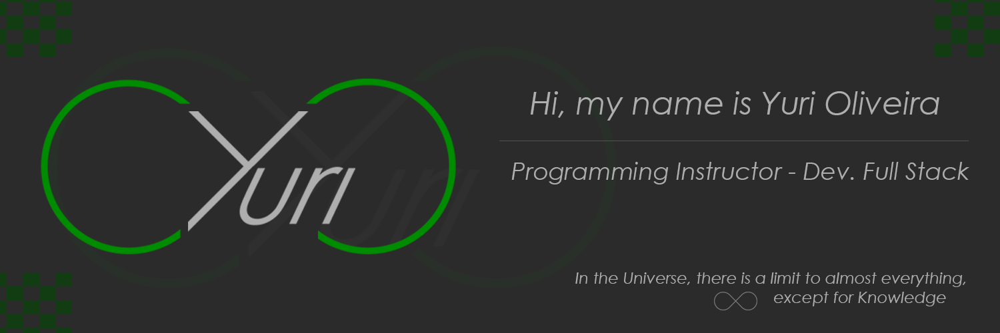

<h2 align="center">Greetings everyone! 

</h2>

<h3 align="center">Programming teacher focused on learning and sharing knowledge for new Generations</h3>

- 🌎 `<>Hello World!</>`😎
- 🔭 I’m currently working on Generation Brazil 🌱
- 💬 Ask me about: Animes, Docto Who, HP Lovecraft, Sherlock Holmes, Science Fiction Book 📖
- ⚡ Fun fact: Eternal Student and Explorer of the World of Technology 🗺️

 

<h3>My Technologies</h3>

 

<h3>Teaching and Learning more</h3>

  

Thank you for reading this far and don't forget to add me on  . See you later.
  

<a href="https://github.com/Yuri-stack">

